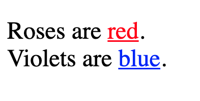

08. Blueprint

# HTML Structure
Now that we know how to spin up a web page, let's get back to the basics and explore how to structure our HTML files better. 📄

Here are some must-haves in a .html file!

The <!DOCTYPE html> is the document type declaration that appears at the top of a .html file and tells the browser that our file is written in HTML5. This is used with a <html> element containing all the code processed on the page.

Notice how the <!DOCTYPE html> doesn’t have a closing tag, while <html> does.

<!DOCTYPE html>
<html>
  Code goes here
</html>

Note: All HTML files must start with a <!DOCTYPE html> declaration and the <html> element.

We skipped them in the first chapter, but they are essential parts of every HTML file.

<!DOCTYPE html>
<html>
  <head>
    Some code goes here
  </head>
  <body>
    A lot more goes here
  </body>
</html>

Inside <html>, there should be two elements:

<head>: This contains all the info for your browser that's not visible on the page.
<body>: This contains all of the content that you will end up seeing on the page.
The <title> element goes in the <head> and assigns text to the tab in our browser.

This is what the browser tab looks like when you visit codedex.io:

The code for this would be:

<!DOCTYPE html>
<html>
  <head>
    <title>Codédex | Start your coding adventure ⋆˙⟡</title>
  </head>
  <body>
    Code goes here
  </body>
</html>

09. Family Tree
# Parents & Children
The elements in our HTML file are arranged much like a family tree. Most individual elements can be parents with one or more child elements.

For example:

<!DOCTYPE html>
<html>
  <head>
    <title>My Web Page</title>
  </head>
  <body>
    
Well, <i>howdy</i> there!

  </body>
</html>

Here are some relationships:

<head> and <body> are children of <html>.
<title> is the child of <head>.
<i> is child of 
 and grandkid of <body>.
Now, what’s the relationship between <i> and <title>? Haha kidding.

# Siblings
Elements can also be siblings if they share a direct parent element. Take this unordered list, for instance:

<body>
  <ul>
    <li>🍄 Mario</li>
    <li>🐢 Luigi</li>
  </ul>
</body>

The two <li> elements are siblings because both are children of the same parent, the <ul> element.

10. Craigslist Ad
# Comments
Comments are useful for taking notes about the logic and intentions behind different parts of our web page. They help us understand what our code is doing, especially if it was written a while ago.

Not only should comments benefit whoever wrote the code, but they should also be helpful to anyone reviewing it later.

How do we comment in HTML? It’s simple:

<!-- I am a comment. -->

And I'm not a comment!

Everything surrounded by the <!-- and --> comment markers is ignored and not rendered on the browser:

<!-- Let’s make you a comment, too. -->
<!-- 
Nooo!
 -->

# Inline vs. Multi-line
Comments are super flexible because they can span multiple lines:

<!--
  This is also a comment.
-->

They can also be used within an element:

This text is visible. <!-- But this is not. -->

Note: It isn't recommended that you be excessive with comments. They should be used sparingly and removed when no longer needed.

11. Wiki Article

# Attributes
Attributes are additional settings that we can use to customize an element.

They are usually name/value pairs, like name="value", where the name and value are separated by an equals sign:

<element name="value">Content</element>

The name indicates the attribute we are setting for our element.
The "value" for our attribute is surrounded by " double quotes.
For example, by default, the <ol> ordered list element uses numbers to label its <li> list item elements.

<ol>
  <li>Power ⚡</li>
  <li>Courage 🔥</li>
  <li>Wisdom 🦉</li>
</ol>

Ordered list with numbered list items.

If we want to use lowercase letters instead:

<ol type="a">
  <li>Power ⚡</li>
  <li>Courage 🔥</li>
  <li>Wisdom 🦉</li>
</ol>

Ordered list with items organized by lowercase letter.

Or, if want to use Roman numerals:

<ol type="i">
  <li>Power ⚡</li>
  <li>Courage 🔥</li>
  <li>Wisdom 🦉</li>
</ol>

Ordered list with items organized by lowercase Roman numeral.

For uppercase list item types for letters and Roman numerals, use type="A" and type="I", respectively.

## Ex 1: Attributes in 
Guess what? We've already been using a few different attributes in the course. Remember when we learned about images?

The  element uses the src attribute to specify the file path of an image.

And remember that width="250" attribute from the previous exercise? Yup! That was an attribute that sets the width of the image.

In addition to src, we can also use the alt attribute to make our images more accessible.

If our image can't appear for some reason, the alt text is displayed instead! This allows assistive devices to read our text and describe the image. 🦻🏻

## Ex 2: Attribute in <a>
We also came across attributes when learning about using links with <a> anchor tags:

<a href="https://www.codedex.io/">Codédex.io</a>

The href attribute is where we add a URL that can be visited when the hyperlinked text is clicked.

We can also use the target attribute and set it to "_blank" to visit the URL on a separate tab on our browser:

<a href="https://www.codedex.io/" target="_blank">Codédex.io</a>

12. Lorem Ipsum

# Classes and IDs
The two attributes we'll come across most are the class and id attributes. Any element can use them. While class and id are used for labeling elements, the two have important differences.

An element can be assigned multiple class values in the form of a space-separated list:

Hello, World

Each element can only have one id value with no spaces. Every id value should be unique in the entire page:

Hello, World

Additionally, id can be used to link to another part of the same page, such as the heading! This can be matched with an <a> anchor element's href attribute via a # hashtag symbol, followed by the identifier used for the id:

<a href="#medellin">Link to Medellín</a>

<h2 class="city" id="medellin">Medellín 🇨🇴</h2>

Lastly, where only one id can be assigned to a single element, a class can be assigned to many:

<h2 class="city" id="medellin">Medellín 🇨🇴</h2>
<h2 class="city" id="libson">Lisbon 🇵🇹</h2>
<h2 class="city" id="bali">Bali 🇮🇩</h2>

13. Power Rangers
# The style Attribute
So far, the appearance of our pages has been pretty skeletal. Just some plain text with the occasional list, image, or link.

But what if there were ways to improve this within our .html files? As it turns out, there are!

First, we can apply a style attribute to any HTML element to stylize certain aspects of that element, such as what color the text should be:

  Roses are red. 
  Violets are blue.

This attribute uses a special syntax where a style is made of a property (i.e., color) and a value (red), separated by a : colon. Multiple styles can be applied to a single element, but they must be separated by a ; semi-colon.

  Roses are red. 
  Violets are blue.

The following is the rendered paragraph with our styles applied to the  elements:

The color property sets the color for the text of an element.
The text-decoration adds text formatting (such as underline), similar to what the <b>, <i>, <u>, and <s> elements do.

This is actually a language called CSS, which we will learn in the next course.

# The 
  </head>
  <body>
    ... Elements go here
  </body>
</html>

Elements can be selected inside the 

Remember when we learned about the class and id attributes? Inside the 
  </head>
  <body>
    

      Roses are red. 
      Violets are blue. 
    

  </body>
</html>

14. MySpace Top 8

Congrats! You’ve finished another chapter! 🥳

Here’s a quick recap:

Every HTML file should have a <!DOCTYPE html> declaration and an <html> element.
The <head> element contains important info for our page, such as the <title>.
Comments <!-- --> are great for documentation or excluding unwanted code.
Attributes like class/id or src can enhance the way our elements are organized, present, and work on our page.
We can add styles to our page using either the <style> element or the style attribute.
Let’s put your knowledge to the test by creating a fun HTML project from scratch!